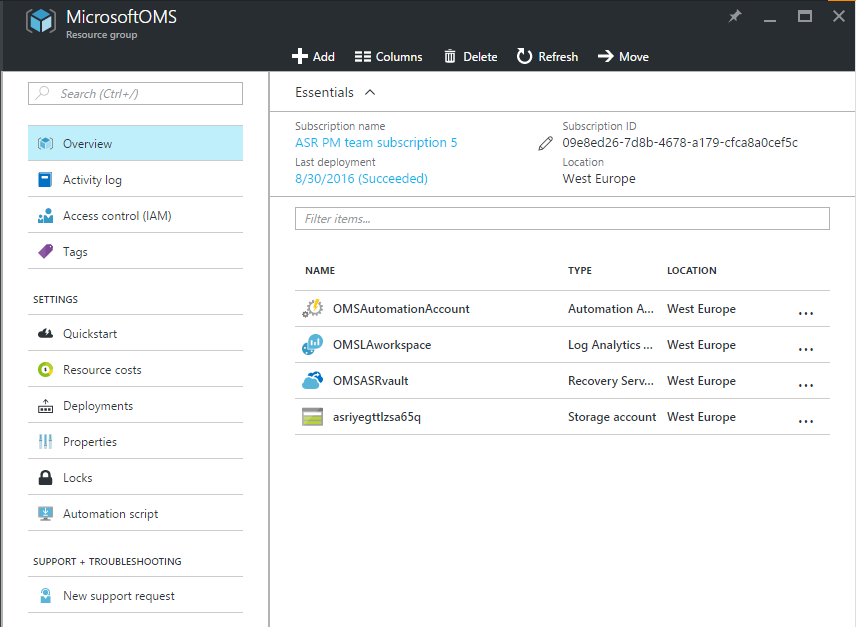
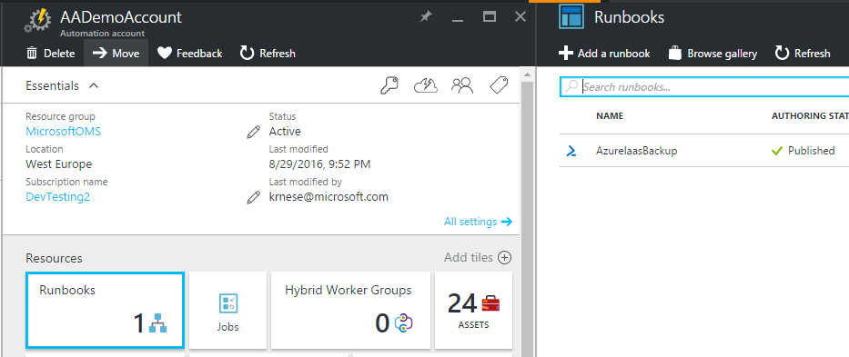
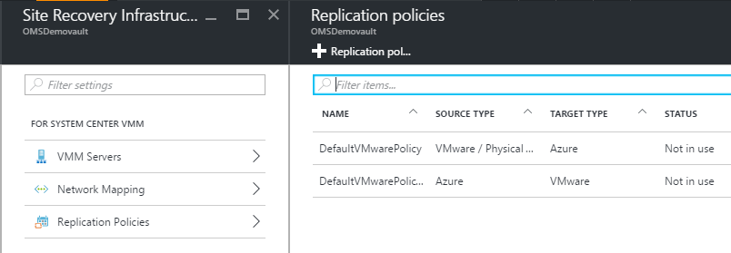
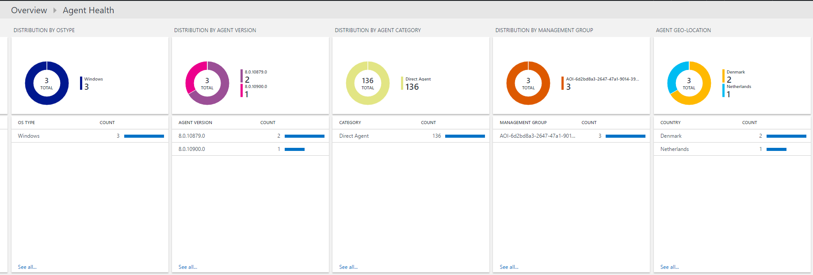

# Docker Enterprise Edition (EE) for Azure with Microsoft Operations Management Suite

[](https://portal.azure.com/#create/Microsoft.Template/uri/https%3A%2F%2Fraw.githubusercontent.com%2FAzure%2Fazure-quickstart-templates%2Fmaster%2Fdocker-ee-oms%2Fazuredeploy.json) 
<a href="http://armviz.io/#/?load=https%3A%2F%2Fraw.githubusercontent.com%2FAzure%2Fazure-quickstart-templates%2Fmaster%2Fdocker-ee-oms%2Fazuredeploy.json" target="_blank">
    
</a>

The [Docker EE for Azure](https://docs.docker.com/docker-for-azure/why/) project was created and is being actively developed to ensure that Docker users can enjoy a fantastic out-of-the-box experience on Azure. It is now generally available and can now be used by everyone.

Operations Mangement Suite (OMS) includes a [Container Monitoring Solution](https://docs.microsoft.com/en-us/azure/log-analytics/log-analytics-containers) that enables users to monitor a Docker EE environment in a single pane of glass.

## Docker EE for Azure Resource Manager Template

This template deploys Docker EE into a Resource Group. 

> A license key must be provided at provisioning time. For a free 30 day trial, check out the [Docker Store](https://store.docker.com/editions/enterprise/docker-ee-trial)

Please see the [documentation](https://docs.docker.com/docker-for-azure/#prerequisites) for details about setup and configuration, including information about [upgrading](https://docs.docker.com/docker-for-azure/upgrade/) your cluster, [deploying](https://docs.docker.com/docker-for-azure/deploy/) a container, and using [volumes](https://docs.docker.com/docker-for-azure/persistent-data-volumes/) with Azure Storage.

### Post deployment

Once the OMS deployment is completed, enable the Container Monitoring Solution from the OMS Portal. Then, deplkoy a Docker Service for the [`microsoft/oms`](https://hub.docker.com/r/microsoft/oms/) image. See the [documentation](https://docs.microsoft.com/en-us/azure/log-analytics/log-analytics-containers#configure-an-oms-agent-for-docker-swarm) for setting up via the command line.

Locate the Universal Control Plane URL in the outputs of the deployment operation blade and log in via the browser. Next, download your user's Client Bundle for [CLI Access](https://docs.docker.com/datacenter/ucp/2.2/guides/user/access-ucp/cli-based-access/) and run the following in a shell:

```sh
# Set workspace credentials
OMS_WORKSPACE=<your_workspace_id>
OMS_KEY=<your_workspace_primary_key>

# Create Secrets
echo $OMS_WORKSPACE | docker secret create OMS_WORKSPACE -
echo $OMS_KEY | docker secret create OMS_KEY -

# Confirm Secrets Creation
# Response should include OMS_WORKSPACE & OMS_KEY
docker secret ls

# Deploy Service
docker service create  \
    --name omsagent \
    --mode global  \
    --mount type=bind,source=/var/run/docker.sock,destination=/var/run/docker.sock \
    --secret source=OMS_WORKSPACE,target=WSID \
    --secret source=OMS_KEY,target=KEY  \
    --publish 25225:25225 \
    --publish 25224:25224/udp \
    --restart-condition=on-failure \
    --detach=false \
    microsoft/oms:latest

# Confirm Service Creation
# Response should include "omsagent"
docker service ls
```

> [Secret creation](https://docs.docker.com/datacenter/ucp/2.2/guides/user/secrets/) and [service deployment](https://docs.docker.com/datacenter/ucp/2.2/guides/user/services/deploy-a-service/) can also be done via the Universal Control Plane in a browser

## Microsoft OMS Azure Resource Manager Template

This template will deploy *all* the OMS services into a Resource Group



* Azure Log Analytics

Instead of spending time adding data sources to your workspace and constructing the search queries for common scenarios, you will have multiple solutions enabled by default, common Windows and Linux logs present, as well as some of the most used performance counters regardless of platform. With saved searches categorized in the workspace, it is easy to get started immediately after you have added your machines to the workspace

* Azure Automation

The template will create several assets for you to use, such as credentials and variables that can be used out-of-the-box with the runbooks provided. All the dependencies are there.

* Azure Backup

Get started immediately post deployment by running the provided runbook in Azure Automation that will enable Azure IaaS backup on your VMs present within the region where you deployed your Recovery Vault

* Azure Site Recovery

After deployment, you just have to add your Hyper-V hosts or/and Management/Configuration Servers to the Recovery Vault and leverage the pre-created Hyper-V site and policies for your replication provider
You can leverage the pre-created storage account as target for your replication scenarios.

### Post Deployment

* Enable Azure IaaS Backup using a runbook



* Add Hyper-V hosts to your primary Hyper-V site and associate them with the default replication policy


* Associate your Management/Configuration Servers with the default replication policy



* Explore the solutions within Log Analytics after adding VMs/servers and storage accounts

The template will enable the following solutions:
	
	* Change Tracking
	* Security and Audit
	* System Update Assessment
	* Agent Health


Explore a rich list of saved searches within Log Search


Explore the Agent Health solution



Explore the Updates solution


Explore the Security solution


*This template will be updated to add more capabilities*

       